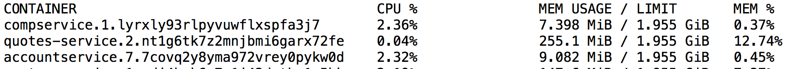
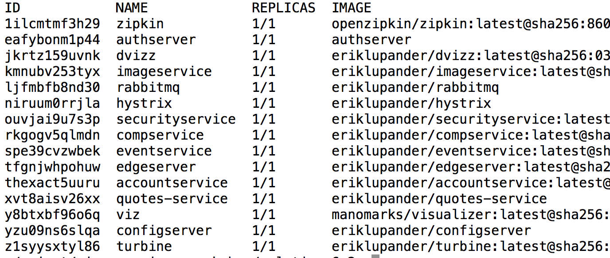

이 블로그 시리즈에서는 Microservices들을 Go로 작성하며 이 Microservices들을 Docker Swarm과 Spring Cloud / Netflix OSS 환경에서 실행하는 것을 목표로 합니다. 

### Landscape Overview


- 점선 박스 : 논리적인 Docker Swarm cluster입니다. 하나 또는 여러가지 노드가 될수 있습니다.
- 파란 박스 : 3rd Party 서비스들입니다.
    - ex ) Spring Cloud , RabbitMQ
- 연갈색 박스 : 마이크로서비스

### Why Microservices in Go?

왜 다른 언어대신 Go를 사용했을까요? 생산성과 재미를 떠나 Go 프로그램들이 차지하는 메모리가 제일 큰 이유입니다. 아래 사진을 보고 Spring boot + Spring Cloud 애플리케이션을 비교해보겠습니다. 



comp service와 account service는 go로 작성이 되었고, quotes service는 spring boot로 작성이 되었습니다. 

과연 이 리소스 비교가 현세대에서 의미가 있을까요? 현세대에서 255MB정도의 메모리 사용량은 무시해도 될만큼 컴퓨터가 좋아지지 않았나요? 

물론 위의 의문들도 맞는 말이지만 큰 엔터프라이즈 기업에서는 10개의 적은 서비스 수가 아닌 100개 혹은 1000개 정도의 컨테이너위에서 작동하는 서비스들을 클라우드 위에서 작동시킬 것입니다. 기업 입장에서는 많은 서비스들을 배포해야 함으로 리소스 면에서는 최대한 효율적으로 가지고 싶을 것 입니다. 


위 ec2 billing 차트에서 똑같은 CPU 코어에서 램을 두배의 용량으로 가져갈 경우 한 시간당 비용이 두배로 증감하는 것을 확인할 수 있습니다. 비용을 절감하기 위해서는 RAM을 최소화하는 것이 좋아보입니다. 

### Microservice Features

보통 마이크로서비스들은 아래 주제들을 다룹니다

- Centralized configuration
- Service Discovery
- Logging
- Distributed Tracing
- Circuit Breaking
- Load balancing
- Edge
- Monitoring
- Security

이 블로그에서는 Go 관점에서 위 주제들을 다룰 예쩡입니다. 

### Docker Swarm

이 블로그에서는 모든 서비스를 Docker Swarm Container 클러스터에서 실행시킬 것입니다 (config server, edge 포함). 블로그 연재가 끝난 후 아래 쉘 커맨드입력시

```bash
docker service ls
```



위와 같은 결과를 얻을 겁니다. 

### Performance

Go가 작은 메모리를 차지하는 것은 이해했으나 성능도 보장이 될까요? 프로그래밍 언어를 서로 benchmarking하는 것은 상당히 어려워 질 수 있습니다. 사실 `Benchmarkgame`라는 사이트에서 사람들이 알고리즘을 다양한 언어로 구현후 벤치마킹한 결과 Go가 평균적으로 Java8보다 살짝(slightly) 빠른 것을 확인할 수 있습니다. 사실 Go는 어떤 케이스에서는 C++와 견줄 수 있을 만큼 성능이 빠르나 어떤 케이스에서는 현저히 느립니다. 하지만 "microservice" 관점에서 Go Application의 성능은 좋은편에 속합니다. 

Go의 특징 중 주목해야할 다른 점은 Garbage Collection을 사용한다는 점입니다. Go 1.5버전에서 GC의 큰 변경 후 Go에서 GC는 최대 few ms만큼 멈춥니다. JVM진영에서 온 개발자들은 Go GC가 성숙치 못하다고 느낄 수 있으나 신뢰할 수 있을 정도로 보입니다. 하지만 GOGC라는 하나의 환경변수만으로 GC를 설정할수 있습니다. 

- GOGC : GC가 실행되는 시점을 control할 수 있음 default가 100이면 heap이 전 GC 상태의 heap 크기의 2배가 될때까지 실행 되지 않음.

### Boot Time

Go Application의 장점 중 하나는 시작이 매우 빠른점입니다. 도커 컨테이너에서 go로 작성된 http server + json serializer 애플리케이션은 최대 10초 미만안에 실행 되고, spring boot app은 최소 10초정도의 시간이 필요합니다. 이러한 점이 매우 중요한 요소는 아니겠지만 트래픽 상승으로 인한 instance들을 늘릴 때 장점을 발휘할 수 있습니다. 

### Statically linked binaries

Docker Container를 Go microservice를 실행시킬 때 큰 이점은 하나의 애플리케이션을 statically linked binary로 제공할 수 있스빈다. (의존성+라이브러리 포함). 바이너리 또한 10~20mb밖에 되지 않으며 Dockerfile을 작성하기 매우 쉽습니다. 다른 말로 JVM이나 다른 런타임 컴포넌트가 필요하지 않으며 단지 c library (libc)만 필요합니다.
