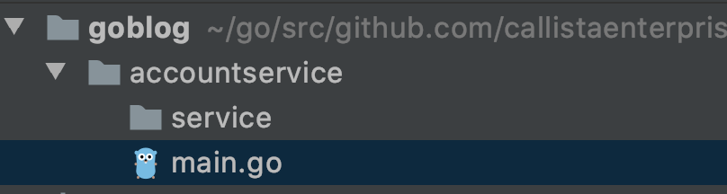
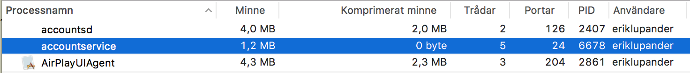

Part 2에서는 

- Go Workspace 구축
- 첫번째 Microservice 개발 : HTTP 서버

### Introduction

HTTP 기반하여 JSON으로 통신하는 방법이 서비스 간의 유일한 방식은 아니지만 이 블로그 시리즈에서는 HTTP와 JSON을 사용하겠습니다. 

사실 많은 유용한 프레임워크 (security, tracing)들은 HTTP 헤더에 의존합니다. grpc같은 다른 방법들도 존재하지만 구현에 집중하기 위해 HTTP로 진행하겠습니다. 

### Go Workspace 구축

```bash
mkdir $GOPATH/src/github.com/callistaenterprise
cd $GOPATH/src/github.com/callistaenterprise
mkdir -p goblog/accountservice
cd goblog/accountservice
touch main.go
mkdir service
```



### /service/routes.go

```go
package service

import "net/http"

// Defines a single route, e.g. a human readable name, HTTP method and the
// pattern the function that will execute when the route is called.
type Route struct {
	Name        string
	Method      string
	Pattern     string
	HandlerFunc http.HandlerFunc
}

// Defines the type Routes which is just an array (slice) of Route structs.
type Routes []Route

// Initialize our routes
var routes = Routes{

	Route{
		"GetAccount",                                     // Name
		"GET",                                            // HTTP method
		"/accounts/{accountId}",                          // Route pattern
		func(w http.ResponseWriter, r *http.Request) {
			w.Header().Set("Content-Type", "application/json; charset=UTF-8")
			w.Write([]byte("{\"result\":\"OK\"}"))
		},
	},
}
```

### /service/router.go

```go
package service

import (
	"github.com/gorilla/mux"
)

// Function that returns a pointer to a mux.Router we can use as a handler.
func NewRouter() *mux.Router {

	// Create an instance of the Gorilla router
	router := mux.NewRouter().StrictSlash(true)

	// Iterate over the routes we declared in routes.go and attach them to the router instance
	for _, route := range routes {

		// Attach each route, uses a Builder-like pattern to set each route up.
		router.Methods(route.Method).
			Path(route.Pattern).
			Name(route.Name).
			Handler(route.HandlerFunc)
	}
	return router
}
```

### /service/webserver.go

```go
package service

import (
	"log"
	"net/http"
)

func StartWebServer(port string) {

	r := NewRouter()
	http.Handle("/", r)

	log.Println("Starting HTTP service at " + port)
	err := http.ListenAndServe(":" + port, nil)    // Goroutine will block here

	if err != nil {
		log.Println("An error occured starting HTTP listener at port " + port)
		log.Println("Error: " + err.Error())
	}
	
}
```

### main.go

```go
package main

import (
	"fmt"
	"github.com/callistaenterprise/goblog/accountservice/service"
)

var appName = "accountservice"

func main() {
	fmt.Printf("Starting %v\n", appName)
	service.StartWebServer("6767")
}
```

```bash
> go get
> go run *.go
Starting accountservice
2017/01/31 15:15:57 Starting HTTP service at 6767
...
> curl http://localhost:6767/accounts/10000
  {"result":"OK"}
```

### Performance

Apache Maven + JRE가 설치되있다고 가정합니다. 

```bash
mkdir /globlog/loadtest
cd /globlog/loadtest
> mvn gatling:execute -Dusers=1000 -Dduration=30 -DbaseUrl=http://localhost:6767
```

- users : 테스트 유저 수
- duration : 테스트가 진행되는 시간 (s)
- baseUrl : docker swarm에서는 ip로 변경

완료가 되면 /target/gatlkng/result/에 html 결과가 나옵니다 

- 테스트 전  : 1.2MB

    

- 1000개 유저 부하 테스트 후 : 28MB이지만 스프링 부트가 시작될 때 사용하는 메모리의 1/10정도 됩니다

    

- CPU Core : 8% on single core

    
