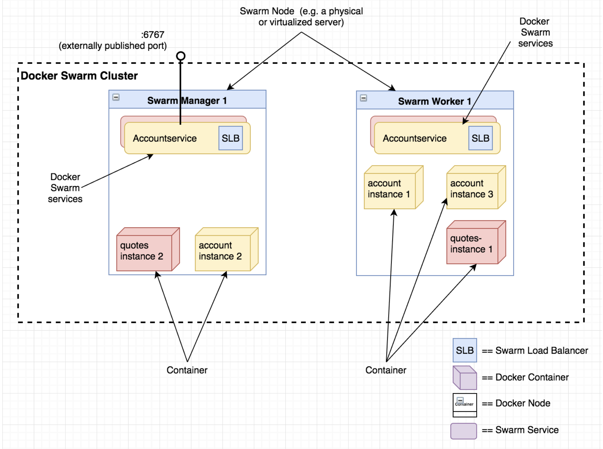

Part5에서는 로컬 환경에서 Docker Swarm cluster을 배포하여 account-service를 실행시키겠습니다. 

이번 파트에서는

- Docker Swarm & Container Orchestration
- Docker로 accountservice를 컨테이너화
- 로컬 Docker Swarm Cluster 세팅
- accountservice를 swarm service로 배포

내용을 다루겠습니다. 

### What is Container Orchestration?

애플리케이션이 더 복잡해지고 트래픽이 많아지면 아마 우리는 몇 백대의 서비스 instances들을 다루는 문제에 직면할 것입니다. Container Orchestration은 사용자가 이 서비스 instance들이 실행되고 있는 hardware 혹은 vm을 하나의 entity로 관리할 수 있게 해줍니다. 

`thenwstack.io` 에서는 이렇게 container orchestration을 정의합니다.

```
"abstracting the host infrastructure, orchestration tools allow users to treat the entire cluster as a single deployment target."
```

C.O는 서비스(소프트웨어)의 생명주기를 관리하며 서비스 디스커버리, 로드밸런싱, 내부 주소 지정, 로깅 등 많은 기능을 제공합니다. 

### Docker Swarm의 핵심 기능

Docker swarm을 소개할 때 보통 아래의 3가지 컨셉을 언급합니다.

- Node : Swarm에 참여하는 Docker Engine입니다. 자신만의 CPU, 메모리, 네트워크 인터페이스를 가지고 있는 하나의 host라고 보셔도 무방합니다. Node는 `manager node`  와 `worker node` 로 두가지 종류가 있습니다.
- Service : worker node에 실행 되는 entity입니다. 서비스는 container 이미지나 사용자가 컨테이너에 요청한 명령일 수도 있습니다. 서비스는 `replicated` , `global` 의 두 종류로 구분됩니다.
- Task : Docker Container의 task라고 보시면 됩니다. 도커 문서에서는 task를 "도커 컨테이너와 컨테이너 안의 명령들을 포함함"이라고 말합니다.

아래 그림은 두개의 노드와 총 5개의 컨테이너, 2개의 서비스를 실행 시켰을때를 시각화합니다. 



### Accountservice 도커 이미지 만들기  /accountservice/Dockerfile

```bash
env GOOS=linux go build -o accountservice-linux-amd64
```

```Dockerfile
FROM iron/base

EXPOSE 6767
ADD accountservice-linux-amd64 /
ENTRYPOINT ["./accountservice-linux-amd64"]
```

- FROM : base image
- EXPOSE : 도커 내부 네트워크에서 노출할 포트 번호
- ADD : accountservice-linux-amd64를 /로 옮겨라
- ENTRYPOINT : 컨테이너가 시작되면 실행할 명령어

```bash
(base) ➜ docker build -t jong1994/accountservice .

Sending build context to Docker daemon  8.425MB
Step 1/4 : FROM iron/base
 ---> b438fe7f76e9
Step 2/4 : EXPOSE 6767
 ---> Using cache
 ---> 7711853386c0
Step 3/4 : ADD accountservice-linux-amd64 /
 ---> 4ac352ee1c14
Step 4/4 : ENTRYPOINT ["./accountservice-linux-amd64"]
 ---> Running in bf0c48c4ca1c
Removing intermediate container bf0c48c4ca1c
 ---> 820298060ad4
Successfully built 820298060ad4
Successfully tagged jong1994/accountservice:latest

(base) ➜ docker run --rm jong1994/accountservice
Starting accountservice
Seeded 100 fake accounts...
2020/08/29 09:45:03 Starting HTTP service at 6767

(base) ➜ docker push jong1994/accountservice
```

이 컨테이너는 로컬호스트에서 실행되는게 아니고 컨테이너만의 네트워크 컨텍스트를 가져 현재 우리 컴퓨터의 localhost에서 직접적인 통신이 불가능합니다. 

### Docker Swarm Single-Node Docker Swarm Cluster

이 블로그 시리즈에서는 마이크로서비스를 컨테이너 오케스트레이션 안에서 실행시키는 것이 목적입니다. 이번에는 도커 스웜 클러스터를 docker-machine에 실행시키겠습니다. 

### Docker-machine으로 가상 서버 생성

```bash
(base) ➜ docker-machine create --driver virtualbox swarm-manager-1

Running pre-create checks...
Creating machine...
(swarm-manager-1) Copying /Users/imac/.docker/machine/cache/boot2docker.iso to /Users/imac/.docker/machine/machines/swarm-manager-1/boot2docker.iso...
(swarm-manager-1) Creating VirtualBox VM...
(swarm-manager-1) Creating SSH key...
(swarm-manager-1) Starting the VM...
(swarm-manager-1) Check network to re-create if needed...
(swarm-manager-1) Waiting for an IP...
Waiting for machine to be running, this may take a few minutes...
Detecting operating system of created instance...
Waiting for SSH to be available...
Detecting the provisioner...
Provisioning with boot2docker...
Copying certs to the local machine directory...
Copying certs to the remote machine...
Setting Docker configuration on the remote daemon...
Checking connection to Docker...
Docker is up and running!
To see how to connect your Docker Client to the Docker Engine running on this virtual machine, run: docker-machine env swarm-manager-1
```

### Swarm Manager-Node 만들기

도커 스웜 클러스터는 최소 하나의 Swarm Manager를 가지며 여러개의 Swarm Workers를 가질 수 있습니다. 이번 예제에서는 간단히 Swarm Manager하나만 사용하겠습니다. 

```bash
> docker $(docker-machine config swarm-manager-1) swarm init --advertise-addr $(docker-machine ip swarm-manager-1)

Swarm initialized: current node (z9n7injg74w2rumskchrj439b) is now a manager.

To add a worker to this swarm, run the following command:

    docker swarm join --token SWMTKN-1-3tf5pna4ofp2qltzb7z4tbflzsvkybvs3uo18he09u70za5dgn-5gigsocdd7pp9nyt07sg34fxr 192.168.99.103:2377

To add a manager to this swarm, run 'docker swarm join-token manager' and follow the instructions.
```

### Overlay Network

도커 overlay network를 설정함으로서 스웜 클러스터 안에서 컨테이너간 통신이 원활하게 이뤄지게 할 수 있습니다.

```bash
(base) ➜ accountservice docker-machine ssh swarm-manager-1
   ( '>')
  /) TC (\   Core is distributed with ABSOLUTELY NO WARRANTY.
 (/-_--_-\)           www.tinycorelinux.net

docker@swarm-manager-1:~$ docker network create --driver overlay my_network
di5uc9eukmg6tghzpntgq3eqt
```

### accountservice 배포하기

```bash
> docker@swarm-manager-1:~$ docker pull jong1994/accountservice
Using default tag: latest
latest: Pulling from jong1994/accountservice
ff3a5c916c92: Pull complete
412e50f87338: Pull complete
bf9e3cf0b8f2: Pull complete
Digest: sha256:1fd0cf1b99b6ac288506ff61d13b6766217193a9bd3984c21c1b8b4675da941b
Status: Downloaded newer image for jong1994/accountservice:latest
docker.io/jong1994/accountservice:latest

> docker@swarm-manager-1:~$ docker service create --name=accountservice --replicas=1 --network=my_network -p=6767:6767 jong1994/accountservice
5g9np12pmtrj1jt7m8nvqp9m6
overall progress: 1 out of 1 tasks
1/1: running
verify: Service converged
```

docker-machine manager node에서 아까 도커 hub에 업로드한 이미지를 가져와 서비스를 만들었습니다. 

- —name: logical한 서비스 이름을 등록합니다. 이 이름으로 다른 서비스들은 ip 주소대신 이 서비스에 접근합니다. ex ) [http://accountservice:6767/accounts/10000](http://accountservice:6767/accounts/10000)
- —replicas: 서비스의 instance 개수 입니다. 우리가 노드가 여러개를 가지고 있었다면 스웜 엔진이 이 인스턴스 수 만큼 노드들에게 서비스들을 위치 시킵니다
- —network : 서비스를 위치 시킬 네트워크를 지정합니다
- -p : 포트 지정, 만약 6767:80으로 지정했다면 클러스터 밖에서 80번 포트로 접근했어야합니다. 사실 이렇게 외부에게 포트를 직접 노출 시키는 것 보다는 routing 규칙 + 보안 설정이 되있는 Edge-Server ( reverse-proxy)를 두어 서비스에게 연결시키는 방식을 택해야합니다.

### localhost에서 통신해보기

```bash
(base) ➜ ~ export ManagerIP=`docker-machine ip swarm-manager-1`
(base) ➜ ~ echo $ManagerIP
192.168.99.103
(base) ➜ ~ curl $ManagerIP:6767/accounts/10000
{"id":"10000","name":"Person_0"}%
```
