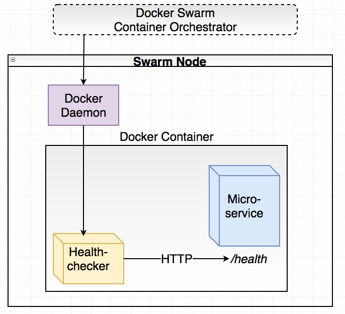

마이크로서비스가 더 커지고 복잡해짐에 따라 각 서비스가 Docker Swarm에게 자신이 healthy함을 알려야합니다. 이번 파트에서는 마이크로서비스에 health check을 등록해보겠습니다. 

우리의 accountservice 마이크로서비스는 

- HTTP 통신
- 데이터베이스 연결

이 되지 않는다면 사실 무용지물입니다 

이런 경우가 발생시 자신의 연결상태를 알리기 위해 healthcheck endpoint를 제공하는 방법이 있습니다. 우리의 마이크로서비스들은 http 기반이기 때문에 /health 엔드포인트를 제공하여 문제가 없다면 200 StatusCode를 문제가 있다면 에러 StatusCode를 에러 메시지와 함께 반환하도록 하는 방법입니다. 

### /dbclient/boltclient.go

데이터베이스 연결을 확인하는 아주 간단한 메소드를 하나 만들겠습니다. 

```go
type IBoltClient interface {
	OpenBoltDb()
	QueryAccount(accountId string) (model.Account, error)
	Seed()
	Check() bool 
}

// Naive healthcheck, just makes sure the DB connection has been initialized.
func (bc *BoltClient) Check() bool {
	return bc.boltDB != nil
}
```

### /service/handlers.go

```go
func HealthCheck(w http.ResponseWriter, r *http.Request) {
	// Since we're here, we already know that HTTP service is up. Let's just check the state of the boltdb connection
	dbUp := DBClient.Check()
	if dbUp {
		data, _ := json.Marshal(healthCheckResponse{Status: "UP"})
		writeJsonResponse(w, http.StatusOK, data)
	} else {
		data, _ := json.Marshal(healthCheckResponse{Status: "Database unaccessible"})
		writeJsonResponse(w, http.StatusServiceUnavailable, data)
	}
}

func writeJsonResponse(w http.ResponseWriter, status int, data []byte) {
	w.Header().Set("Content-Type", "application/json")
	w.Header().Set("Content-Length", strconv.Itoa(len(data)))
	w.WriteHeader(status)
	w.Write(data)
}

type healthCheckResponse struct {
	Status string `json:"status"`
}
```

### /service/routes.go

```go
var routes = Routes{
	Route{
		"GetAccount",                                     // Name
		"GET",                                            // HTTP method
		"/accounts/{accountId}",                          // Route pattern
		GetAccount,
	},
	Route{
		"HealthCheck",
		"GET",
		"/health",
		HealthCheck,
	},
}
```

```bash
> go run *.go
Starting accountservice
Seeded 100 fake accounts...
2017/03/03 21:00:31 Starting HTTP service at 6767

> curl localhost:6767/health
{"status":"UP"}
```

### Docker HealthCheck



다음으로 Docker HealthCheck 메커니즘을 사용하여 Docker Swarm이 우리의 서비스의 상태를 알 수 있도록 하겠습니다. Dockerfile에 이 한 줄만 추가 하면되는데요 

```docker
HEALTHCHECK --interval=5s --timeout=5s CMD ["./healthchecker-linux-amd64", "-port=6767"] || exit 1
```

healthheck-linux-amd64는 뭐하는 놈일까요? 이 메커니즘을 사용하기 위해 우리는 도커를 좀 도와줘야합니다 ㅎㅎ. 도커는 혼자 사실 우리가 만든 /heath 엔드포인트에게 http 통신할 http client를 가지고 있지 않습니다. 대신 HEALTHCHECK으로 도커에게 우리가 명령어를 제공할 수 있는데요, 그래서 이 healthcheck-linux-amd64라는 go http client binary를 만들어보겠습니다. (사실 curl로도 가능한데 일단 이렇게 해보죠) 

### /healthchecker/main.go

```go
package main

import (
	"flag"
	"net/http"
	"os"
)

func main() {
	port := flag.String("port", "80", "port on localhost to check")
	flag.Parse()

	resp, err := http.Get("http://127.0.0.1:" + *port + "/health")    // Note pointer dereference using *

	// If there is an error or non-200 status, exit with 1 signaling unsuccessful check.
	if err != nil || resp.StatusCode != 200 {
		os.Exit(1)
	}
	os.Exit(0)
}
```

- flag를 사용해서 -port에 준 값을 읽어옵니다. 없으면 80을 사용합니다.
- GET 127.0.0.1:[port]/health로 메시지를 보냅니다
- exit code 0,1 > 리턴값에 따라

accountservice에서 healthcheck를 빌드합시다 

```bash
➜ env GOOS=linux go build -o accountservice-linux-amd64
➜ env GOOS=linux go build  -o healthchecker-linux-amd64 ./healthchecker
```

### Dockerfile

```docker
FROM iron/base
EXPOSE 6767

ADD accountservice-linux-amd64 /

ADD healthchecker-linux-amd64 /
HEALTHCHECK --interval=3s --timeout=3s CMD ["./healthchecker-linux-amd64", "-port=6767"] || exit 1

ENTRYPOINT ["./accountservice-linux-amd64"]
```

```bash
➜ docker build -t jong1994/accountservice .
Sending build context to Docker daemon  15.47MB
Step 1/6 : FROM iron/base
 ---> b438fe7f76e9
Step 2/6 : EXPOSE 6767
 ---> Using cache
 ---> 7711853386c0
Step 3/6 : ADD accountservice-linux-amd64 /
 ---> Using cache
 ---> 4ac352ee1c14
Step 4/6 : ADD healthchecker-linux-amd64 /
 ---> 9e8df2379f7d
Step 5/6 : HEALTHCHECK --interval=3s --timeout=3s CMD ["./healthchecker-linux-amd64", "-port=6767"] || exit 1
 ---> Running in e2d86181ccbb
Removing intermediate container e2d86181ccbb
 ---> 3bca284588e6
Step 6/6 : ENTRYPOINT ["./accountservice-linux-amd64"]
 ---> Running in 13526c591851
Removing intermediate container 13526c591851
 ---> 9ddd8c9731fc
Successfully built 9ddd8c9731fc
Successfully tagged jong1994/accountservice:latest

➜ docker push jong1994/accountservice
The push refers to repository [docker.io/jong1994/accountservice]
8c4106b2f8d2: Pushed
3261c97c1a5e: Layer already exists
f66908b454c8: Layer already exists
cd7100a72410: Layer already exists
latest: digest: sha256:4d06011225505806015a683cde46f6f89d90e4af0ba2f9568aa858c939ea4207 size: 1160
```

```bash
➜ docker-machine ssh swarm-manager-1
   ( '>')
  /) TC (\   Core is distributed with ABSOLUTELY NO WARRANTY.
 (/-_--_-\)           www.tinycorelinux.net

docker@swarm-manager-1:~$ docker pull jong1994/accountservice
docker@swarm-manager-1:~$ docker service create --name=accountservice --replicas=1 --network=my_network -p=6767:6767 jong1994/accountservice
```

```bash
> docker ps
CONTAINER ID        IMAGE                             COMMAND                 CREATED        STATUS                
1d9ec8122961        jong1994/accountservice:latest  "./accountservice-lin"  8 seconds ago  Up 6 seconds (healthy)
```

Docker Swarm은 이제 healthcheck을 통해 unhealthy한 컨테이너가 있다면 새로운 컨테이너를 실행시킬 것입니다.
