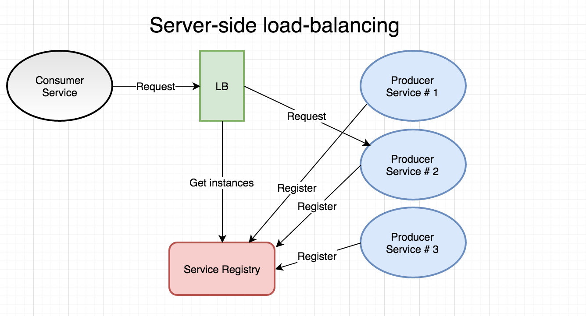

이번 블로그 시리즈에서는 마이크로서비스 아키텍처에서 핵심 요소들인 service discovery와 load balancing에 대해서 다뤄보겠습니다. 

### Intro

로드 밸런싱은 잘 알려진 주제에 반해 서비스 디스커버리에 대해서는 설명이 필요하다고 생각합니다. 

"서비스 A가 서비스 B의 위치에 대한 아무 정보가 없다면 어떻게 서비스 B와 통신할 수 있을까요"

다른 말로 10개의 서비스 B 인스턴스가 여러 노드위에서 실행되고 있다고 하면 누군가 이 모든 정보들을 가지고 있어야하지 않을까요? 서비스 B의 IP 주소 또는 호스트 이름이 서비스 A에게 제공되어야지 않을까요? (client-side load balancing) 또는 서비스 A가 해당 정보들을 알고있는 제 3자에게 정보를 물어봐야하지 않을까요? (server-side load balancing). 마이크로서비스 아키텍처에서는 언급한 두 방법을 해결하기 위해 `service discovery` 라는 메커니즘이 필요합니다. 간단하게 말해서 서비스 디스커버리는 서비스들의 정보를 가지고 있는 레지스트리입니다. 

위에 언급한 내용들이 DNS 서비스처럼 들리신다면 사실 비슷한 맥락입니다. 다른점은 서비스 디스버리는 사실 클러스 안에서 통신하기 위한 메커니즘이죠. DNS 서버와 DNS 프로토콜은 컨테이너들이 수없이 없어졌다 생성되는 마이크로서비스 환경에서는 적합하지 않습니다. 

마이크로서비스 프레임워크들은 거의 대부분 서비스 디스커버리를 제공합니다. \

- Spring Cloud의 Netflix Eureka : 유레카 서버에 다른 서비스들이 간헐적으로 heartbeat을 보내 유리카가 자신들의 살아 있음을 인지하고 있게 만드는 방법이죠
- Go에서는 Consul이란 것이 유명합니다. Consul는 DNS 통합 기능 등 많은 유용한 기능을 제공합니다.
- etcd : 분산 Key-value store를 사용하여 서비스들이 자신들을 등록하는 방법이 잇습니다.
- zookeepr

우리 블로그에서는 Docker Swarm이 제공하는 서비스디스커버리와 로드밸런싱을을 사용하겠습니다. 

### 두 가지의 Load Balancing

보통 마이크로서비스 세계에서는, 로드 밸런싱을 두 가지 종류로 나누고는 합니다. 

- Client Side : 이 방법은 다른 서비스의 정보를 얻기 위해 클라이언트 서비스가 서비스 디스커버리 서비스에 물어보는 방법입니다. 하나의 서비스에 대해서 여러 인스턴스가 있을 때 클라언트 서비스가 로드 밸런싱이나 랜덤 알고리즘 방식을 택하여 하나를 골라 로드 밸런싱을 합니다. 성능 최적화를 위해 클라이언트 사이드에 캐쉬를 두기도 합니다. 실제로 Netflix Ribbon이 이 방법을 택하고 있죠.
    - 장점 : resilience, decnetralization
    - 단점 : internal service 복잡성, 로컬 캐쉬와 서비스 디스커버리 간의 sync

        

- Server Side : 이 방법은 클라이언트가 별도의 로드 밸런서가 다른 서비스의 인스턴스를 하나 골라주기를 원하는 방법입니다. 이 방법은 "proxy"라고도 불리기도 합니다.
    - 단점은 로드밸런서가 bottlenect이 될수도 있겠죠

        

위 그림에서 Producer 서비스의 등록과정처럼 도커 스웜에서는 등록과정이 개발자가 별도로 하지 않아도 됩니다. 도커 스웜이 이 모든 registration / hearbeat / deregistration 역할을 해주는 거죠. 

### 서비스 디스커버리

예를들어 우리가 모니터링 애플리케이션을 만들었고 이 애플리케이션은 모든 배포된 서비스의 인스턴스들의 /health 엔드포인트들을 확인해야한다고 합시다. 이 애플리케이션이 어떤 IP, Port를 사용해야 할지 알까요? 도커 스웜에서는 이 모든 정보를 가지고 있는데요, 어떻게 우리가 이런 정보들을 사용할 수 있을까요? Eurkea 같은 client-side 솔루션에서는 API를 제공하여 API를 사용하기만 하면 되는데, 사실 컨테이너 오케스트레이션에서는 다른 방법을 선택합니다. 

### Docker Remote API

제일 간단한 방법은 Docker Remote API를 사용하는 것입니다. 이 방법은  Swarm Manager에

서비스와 인스턴스 정보를 물어보는 방법이죠. 

다른 방법으로는 

- Eureka, Consul 같은 다른 service discovery mechanism을 사용하는 방법입니다

### Scalaing & Load Balancing

우리의 account service 마이크로서비스를 여러 인스턴스로 실행시켜 도커 스웜이 실제로 로브 밸런싱을 처리하는지 확인해 봅시다 

### /accountservice/model/account.go

```go
package model

type Account struct {
	Id string `json:"id"`
	Name string  `json:"name"`
	// NEW
	ServedBy string `json:"servedBy"`
}
```

### /service/handlers.go

```go
func GetAccount(w http.ResponseWriter, r *http.Request) {

	// Read the 'accountId' path parameter from the mux map
	var accountId = mux.Vars(r)["accountId"]

	// Read the account struct BoltDB
	account, err := DBClient.QueryAccount(accountId)
	account.ServedBy = getIP()
	// If err, return a 404
	if err != nil {
		w.WriteHeader(http.StatusNotFound)
		return
	}

	// If found, marshal into JSON, write headers and content
	data, _ := json.Marshal(account)
	w.Header().Set("Content-Type", "application/json")
	w.Header().Set("Content-Length", strconv.Itoa(len(data)))
	w.WriteHeader(http.StatusOK)
	w.Write(data)
}

// ADD THIS FUNC
func getIP() string {
	addrs, err := net.InterfaceAddrs()
	if err != nil {
		return "error"
	}
	for _, address := range addrs {
		// check the address type and if it is not a loopback the display it
		if ipnet, ok := address.(*net.IPNet); ok && !ipnet.IP.IsLoopback() {
			if ipnet.IP.To4() != nil {
				return ipnet.IP.String()
			}
		}
	}
	panic("Unable to determine local IP address (non loopback). Exiting.")
}
```

```bash
➜  env GOOS=linux go build -o accountservice-linux-amd64
➜  docker build -t jong1994/accountservice .
➜  docker push jong1994/accountservice
```

```bash
curl $ManagerIP:6767/accounts/10000
{"id":"10000","name":"Person_0","servedBy":"10.0.0.22"}

curl $ManagerIP:6767/accounts/10000
{"id":"10000","name":"Person_0","servedBy":"10.255.0.5"}

curl $ManagerIP:6767/accounts/10000
{"id":"10000","name":"Person_0","servedBy":"10.0.0.18"}

curl $ManagerIP:6767/accounts/10000
{"id":"10000","name":"Person_0","servedBy":"10.0.0.22"
```

이런식으로 서비스를 이용한 로브 밸런싱이 넷플릭스 리본처럼 클라이언트 사이드의 복잡성을 제거하여 굉장히 편리합니다. 추가적으로 도커 스웜은 healthcheck을 구현했을 시 unhealthy한 노드로 로드밸런싱을 진행하지 않습니다. 

### 새로운 서비스

도커 스웜이 제공하는 서비스 디스커버리를 확인하기 위해서 새로운 서비스를 만들어 봅시다. 그 전에 accountservice를 바꿔보죵 

### /accountservice/model/account.go

```go
package model

type Account struct {
	Id string `json:"id"`
	Name string  `json:"name"`
	// NEW
	ServedBy string `json:"servedBy"`
	Quote Quote `json:"quote"`         // NEW
}

// NEW struct
type Quote struct {
	Text string `json:"quote"`
	ServedBy string `json:"ipAddress"`
	Language string `json:"language"`
}
```

### /accountservice/service/handler.go

```go
var client = &http.Client{}

func init() {
        var transport http.RoundTripper = &http.Transport{
                DisableKeepAlives: true,
        }
        client.Transport = transport
}

func GetAccount(w http.ResponseWriter, r *http.Request) {

	// Read the 'accountId' path parameter from the mux map
	var accountId = mux.Vars(r)["accountId"]

	// Read the account struct BoltDB
	account, err := DBClient.QueryAccount(accountId)
	account.ServedBy = getIP()

	quote, err := getQuote()
	if err == nil {
	        account.Quote = quote
	}
	// If err, return a 404
	if err != nil {
		w.WriteHeader(http.StatusNotFound)
		return
	}

	// If found, marshal into JSON, write headers and content
	data, _ := json.Marshal(account)
	w.Header().Set("Content-Type", "application/json")
	w.Header().Set("Content-Length", strconv.Itoa(len(data)))
	w.WriteHeader(http.StatusOK)
	w.Write(data)
}

func getQuote() (model.Quote, error) {
        req, _ := http.NewRequest("GET", "http://quotes-service:8080/api/quotes/1", nil)
        resp, err := client.Do(req)

        if err == nil && resp.StatusCode == 200 {
                quote := model.Quote{}
                bytes, _ := ioutil.ReadAll(resp.Body)
                json.Unmarshal(bytes, &quote)
                return quote, nil
        } else {
                return model.Quote{}, fmt.Errorf("Some error")
        }
}
```

도스 스웜컨테이너의 accountservice 이미지도 업데이트해주세요

이제 accountservice와 별개로 quoteservice라는 폴더를 만들어서 작업합시다. accountservice의 healthchecker-linux-amd64를 quoteservice로 복사해주세요. 

### /quoteservice/main.go

```go
package main

import (
	"fmt"
	"github.com/callistaenterprise/goblog/quoteservice/service"
)

var appName = "quoteservice"

func main() {
	fmt.Printf("Starting %v\n", appName)
	service.StartWebServer("8080")
}
```

### /quoteservice/model/quote.go

```go
package model

// NEW struct
type Quote struct {
	Text string `json:"quote"`
	ServedBy string `json:"ipAddress"`
	Language string `json:"language"`
}
```

### /quoteservice/webserver.go

```go
package service

import (
	"log"
	"net/http"
)

func StartWebServer(port string) {

	r := NewRouter()
	http.Handle("/", r)

	log.Println("Starting HTTP service at " + port)
	err := http.ListenAndServe(":" + port, nil)    // Goroutine will block here

	if err != nil {
		log.Println("An error occured starting HTTP listener at port " + port)
		log.Println("Error: " + err.Error())
	}

}
```

### /quoteservice/router.go

```go
package service

import (
	"github.com/gorilla/mux"
)

// Function that returns a pointer to a mux.Router we can use as a handler.
func NewRouter() *mux.Router {

	// Create an instance of the Gorilla router
	router := mux.NewRouter().StrictSlash(true)

	// Iterate over the routes we declared in routes.go and attach them to the router instance
	for _, route := range routes {

		// Attach each route, uses a Builder-like pattern to set each route up.
		router.Methods(route.Method).
			Path(route.Pattern).
			Name(route.Name).
			Handler(route.HandlerFunc)
	}
	return router
}
```

### /quoteservice/routes.go

```go
package service

import (
	"encoding/json"
	"github.com/callistaenterprise/goblog/quoteservice/model"
	"net"
	"net/http"
	"strconv"
)

// Defines a single route, e.g. a human readable name, HTTP method and the
// pattern the function that will execute when the route is called.
type Route struct {
	Name        string
	Method      string
	Pattern     string
	HandlerFunc http.HandlerFunc
}

// Defines the type Routes which is just an array (slice) of Route structs.
type Routes []Route

// Initialize our routes
var routes = Routes{

	Route{
		"GetQuotes",                                     // Name
		"GET",                                            // HTTP method
		"/quotes/{quoteId}",                          // Route pattern
		func (w http.ResponseWriter, r *http.Request) {

		// Read the account struct BoltDB
		quote := &model.Quote{
			Text:     "Hello Steve",
			ServedBy: getIP(),
			Language: "EN",
		}

		// If found, marshal into JSON, write headers and content
		data, _ := json.Marshal(quote)
		w.Header().Set("Content-Type", "application/json")
		w.Header().Set("Content-Length", strconv.Itoa(len(data)))
		w.WriteHeader(http.StatusOK)
		w.Write(data)
	},
	},
	Route{
		"HealthCheck",
		"GET",
		"/health",
		HealthCheck,
	},

}

// ADD THIS FUNC
func getIP() string {
	addrs, err := net.InterfaceAddrs()
	if err != nil {
		return "error"
	}
	for _, address := range addrs {
		// check the address type and if it is not a loopback the display it
		if ipnet, ok := address.(*net.IPNet); ok && !ipnet.IP.IsLoopback() {
			if ipnet.IP.To4() != nil {
				return ipnet.IP.String()
			}
		}
	}
	panic("Unable to determine local IP address (non loopback). Exiting.")
}

func HealthCheck(w http.ResponseWriter, r *http.Request) {
	data, _ := json.Marshal(healthCheckResponse{Status: "UP"})
	writeJsonResponse(w, http.StatusOK, data)
}

func writeJsonResponse(w http.ResponseWriter, status int, data []byte) {
	w.Header().Set("Content-Type", "application/json")
	w.Header().Set("Content-Length", strconv.Itoa(len(data)))
	w.WriteHeader(status)
	w.Write(data)
}

type healthCheckResponse struct {
	Status string `json:"status"`
}
```

### /quoteservice/Dockerfile

```docker
FROM iron/base
EXPOSE 8080

ADD quoteservice-linux-amd64 /

ADD healthchecker-linux-amd64 /
HEALTHCHECK --interval=3s --timeout=3s CMD ["./healthchecker-linux-amd64", "-port=8080"] || exit 1

ENTRYPOINT ["./quoteservice-linux-amd64"]	
```

```bash
env GOOS=linux go build -o quoteservice-linux-amd64
docker build -t jong1994/quoteservice . 
docker push jong1994/quoteservice
```

```docker
docker@swarm-manager-1:~$ docker pull jong1994/accountservice
docker@swarm-manager-1:~$ docker pull jong1994/quoteservice
docker service create --name=accountservice --replicas=3 --network=my_network -p=6767:6767 jong1994/accountservice
docker service create --name=quoteservice --replicas=3 --network=my_network -p=8080:8080 jong1994/quoteservice
```

```docker
➜ curl $ManagerIP:6767/accounts/10000
{"id":"10000","name":"Person_0","servedBy":"10.0.0.30","quote":{"quote":"Hello Steve","ipAddress":"10.0.1.22","language":"EN"}}%                                                                                                                            
➜ curl $ManagerIP:6767/accounts/10000
{"id":"10000","name":"Person_0","servedBy":"10.0.0.29","quote":{"quote":"Hello Steve","ipAddress":"10.0.0.17","language":"EN"}}%                                                                                                                            
➜ curl $ManagerIP:6767/accounts/10000
{"id":"10000","name":"Person_0","servedBy":"10.0.0.31","quote":{"quote":"Hello Steve","ipAddress":"10.0.0.18","language":"EN"}}%
```

accountservice에서 단지 주소를 우리가 service명으로 입력한 quoteservice:8080으로 입력했는데 ip주소를 알아서 찾아서 넣어준것을 확인할 수 있습니당!
