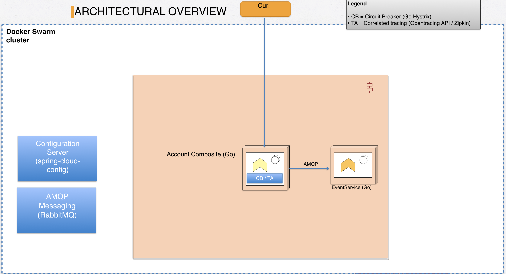
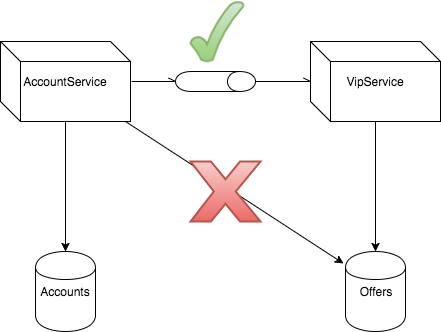
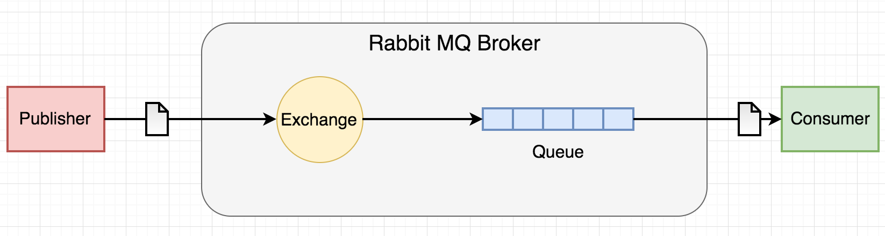
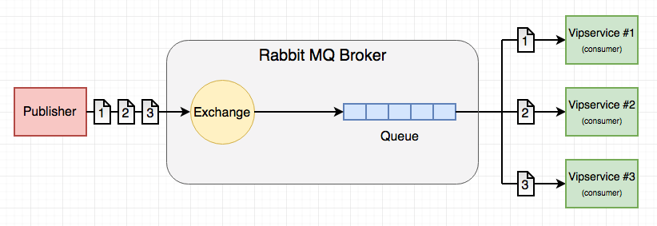

이번 블로그 포스트에서는 go microservice간 RabbitMQ을 사용하여 AMQP 기반 통신을 해보겠습니다.

### Intro

MSA는 애플리케이션의 비즈니스 도메인들을 bounded context기준으로 나누고 서로의 도메인들이 다른 도메인들에게 의존하지 않게 구성합니다. 이방식은 ACID와 달리 데이터들이 eventual consistency합니다. 

MSA에서 서비스들이 loosely coupled 구성되게 위해 서비스 들간의 통신을 http같은 strict request/response 방식 대신 message queue를 이용하는 방법입니다. 

이번 블로그에서는 우리의 "accountservice"가 RabbitMQ를 통해 새로운 서비스로 통신하는 방법을 실습해보겠습니다. 



### 메시지 전송

아주 심플한 use case를 구현해봅시다 : accountservice에서 VIP 회원이 읽어졌을 때, VIP 서비스에게 알림 메시지를 날리는 거죠. 구현할 도메인 모델은 다음과 같습니다. Account와 VIP를 독립적인 도메인으로 두고 서로의 정보를 알지 못하게 하는것이죠. 



accountservice는 vipservice의 데이터베이스에 직접적으로 access가 불가 합니다. 해당 데이터를 얻기 위해서는 vipservice에게 메시지를 보내 얻어야 하죠. 



다시 한번 AMQP가 어떻게 동작하는지 봅시다. 

메세지가 exchange로 publish되고, queue(들)에게 메시지를 복사해 전달합니다. 이 queue들을 고르는 방식은 라우팅 룰에 의해 정해지고 consumer가 등록된 binding이 될수 도 잇습니다. 

### Message Code

accountservice 밖에 /common이라는 폴더를 만들고 /common/messaging, /common/conifg라는 폴더를 만듭시다

AMQP관련 코드들을 messaging 폴더에두고 configuration관련된 코드들을 config foder에 둘겁니다. 

### /common/messaging/messagingclient.go

```go
package messaging

import (
	"github.com/streadway/amqp"
	"fmt"
	"log"
)

// Defines our interface for connecting and consuming messages.
type IMessagingClient interface {
	ConnectToBroker(connectionString string)
	Publish(msg []byte, exchangeName string, exchangeType string) error
	PublishOnQueue(msg []byte, queueName string) error
	Subscribe(exchangeName string, exchangeType string, consumerName string, handlerFunc func(amqp.Delivery)) error
	SubscribeToQueue(queueName string, consumerName string, handlerFunc func(amqp.Delivery)) error
	Close()
}

// Real implementation, encapsulates a pointer to an amqp.Connection
type MessagingClient struct {
	conn *amqp.Connection
}

func (m *MessagingClient) ConnectToBroker(connectionString string) {
	if connectionString == "" {
		panic("Cannot initialize connection to broker, connectionString not set. Have you initialized?")
	}

	var err error
	m.conn, err = amqp.Dial(fmt.Sprintf("%s/", connectionString))
	if err != nil {
		panic("Failed to connect to AMQP compatible broker at: " + connectionString)
	}
}

func (m *MessagingClient) Publish(body []byte, exchangeName string, exchangeType string) error {
	if m.conn == nil {
		panic("Tried to send message before connection was initialized. Don't do that.")
	}
	ch, err := m.conn.Channel()      // Get a channel from the connection
	defer ch.Close()
	err = ch.ExchangeDeclare(
		exchangeName, // name of the exchange
		exchangeType, // type
		true, // durable
		false, // delete when complete
		false, // internal
		false, // noWait
		nil, // arguments
	)
	failOnError(err, "Failed to register an Exchange")

	queue, err := ch.QueueDeclare(// Declare a queue that will be created if not exists with some args
		"", // our queue name
		false, // durable
		false, // delete when unused
		false, // exclusive
		false, // no-wait
		nil, // arguments
	)

	err = ch.QueueBind(
		queue.Name, // name of the queue
		exchangeName, // bindingKey
		exchangeName, // sourceExchange
		false, // noWait
		nil, // arguments
	);

	err = ch.Publish(// Publishes a message onto the queue.
		exchangeName, // exchange
		exchangeName, // routing key      q.Name
		false, // mandatory
		false, // immediate
		amqp.Publishing{
			Body:        body, // Our JSON body as []byte
		})
	fmt.Printf("A message was sent: %v", body)
	return err
}

func (m *MessagingClient) PublishOnQueue(body []byte, queueName string) error {
	if m.conn == nil {
		panic("Tried to send message before connection was initialized. Don't do that.")
	}
	ch, err := m.conn.Channel()      // Get a channel from the connection
	defer ch.Close()

	queue, err := ch.QueueDeclare(// Declare a queue that will be created if not exists with some args
		queueName, // our queue name
		false, // durable
		false, // delete when unused
		false, // exclusive
		false, // no-wait
		nil, // arguments
	)

	// Publishes a message onto the queue.
	err = ch.Publish(
		"", // exchange
		queue.Name, // routing key
		false, // mandatory
		false, // immediate
		amqp.Publishing{
			ContentType: "application/json",
			Body:        body, // Our JSON body as []byte
		})
	fmt.Printf("A message was sent to queue %v: %v", queueName, body)
	return err
}

func (m *MessagingClient) Subscribe(exchangeName string, exchangeType string, consumerName string, handlerFunc func(amqp.Delivery)) error {
	ch, err := m.conn.Channel()
	failOnError(err, "Failed to open a channel")
	// defer ch.Close()

	err = ch.ExchangeDeclare(
		exchangeName, // name of the exchange
		exchangeType, // type
		true, // durable
		false, // delete when complete
		false, // internal
		false, // noWait
		nil, // arguments
	)
	failOnError(err, "Failed to register an Exchange")

	log.Printf("declared Exchange, declaring Queue (%s)", "")
	queue, err := ch.QueueDeclare(
		"", // name of the queue
		false, // durable
		false, // delete when usused
		false, // exclusive
		false, // noWait
		nil, // arguments
	)
	failOnError(err, "Failed to register an Queue")

	log.Printf("declared Queue (%d messages, %d consumers), binding to Exchange (key '%s')",
		queue.Messages, queue.Consumers, exchangeName)

	err = ch.QueueBind(
		queue.Name, // name of the queue
		exchangeName, // bindingKey
		exchangeName, // sourceExchange
		false, // noWait
		nil, // arguments
	);
	if err != nil {
		return fmt.Errorf("Queue Bind: %s", err)
	}

	msgs, err := ch.Consume(
		queue.Name, // queue
		consumerName, // consumer
		true, // auto-ack
		false, // exclusive
		false, // no-local
		false, // no-wait
		nil, // args
	)
	failOnError(err, "Failed to register a consumer")

	go consumeLoop(msgs, handlerFunc)
	return nil
}

func (m *MessagingClient) SubscribeToQueue(queueName string, consumerName string, handlerFunc func(amqp.Delivery)) error {
	ch, err := m.conn.Channel()
	failOnError(err, "Failed to open a channel")

	log.Printf("Declaring Queue (%s)", queueName)
	queue, err := ch.QueueDeclare(
		queueName, // name of the queue
		false, // durable
		false, // delete when usused
		false, // exclusive
		false, // noWait
		nil, // arguments
	)
	failOnError(err, "Failed to register an Queue")

	msgs, err := ch.Consume(
		queue.Name, // queue
		consumerName, // consumer
		true, // auto-ack
		false, // exclusive
		false, // no-local
		false, // no-wait
		nil, // args
	)
	failOnError(err, "Failed to register a consumer")

	go consumeLoop(msgs, handlerFunc)
	return nil
}

func (m *MessagingClient) Close() {
	if m.conn != nil {
		m.conn.Close()
	}
}

func consumeLoop(deliveries <-chan amqp.Delivery, handlerFunc func(d amqp.Delivery)) {
	for d := range deliveries {
		// Invoke the handlerFunc func we passed as parameter.
		handlerFunc(d)
	}
}

func failOnError(err error, msg string) {
	if err != nil {
		fmt.Printf("%s: %s", msg, err)
		panic(fmt.Sprintf("%s: %s", msg, err))
	}
}
```

- 처음에 messgaing interface를 정의 합니다.
- ConnecToBroker() : amqp.Dial을 통해 RabbitMQ Connection을 가져옵니다. 연결될 수 없다면 바로 go application을 panic시키죠

```go
func (m *MessagingClient) ConnectToBroker(connectionString string) {
        if connectionString == "" {
                panic("Cannot initialize connection to broker, connectionString not set. Have you initialized?")
        }

        var err error
        m.conn, err = amqp.Dial(fmt.Sprintf("%s/", connectionString))
        if err != nil {
                panic("Failed to connect to AMQP compatible broker at: " + connectionString)
        }
}
```

- PublishOnQueue() : stready 예제에서 필요한 것들만 추려서 간략하였는데요, 사실 우리가 필요한 인자들은
    - 메시지 payload
    - 큐 이름 입니다.

### /accountservice/model/vipnotification.go

이제 accountservice가 이것들을 사용하게 바꿔 봅시다 

```go
package model

type VipNotification struct {
        AccountId string `json:"accountId"`
        ReadAt string `json:"readAt"`
}
```

### /accountservice/service/handlers.go

```go
var DBClient dbclient.IBoltClient
var MessagingClient messaging.IMessagingClient     // NEW

func GetAccount(w http.ResponseWriter, r *http.Request) {
     ...
		 ...
    notifyVIP(account)   // Send VIP notification concurrently.

    // If found, marshal into JSON, write headers and content
	data, _ := json.Marshal(account)
    writeJsonResponse(w, http.StatusOK, data)
}

// If our hard-coded "VIP" account, spawn a goroutine to send a message.
func notifyVIP(account model.Account) {
        if account.Id == "10000" {
                go func(account model.Account) {
                        vipNotification := model.VipNotification{AccountId: account.Id, ReadAt: time.Now().UTC().String()}
                        data, _ := json.Marshal(vipNotification)
                        err := MessagingClient.PublishOnQueue(data, "vipQueue")
                        if err != nil {
                                fmt.Println(err.Error())
                        }
                }(account)
        }
}
```

go func로 시작하는 Inline 함수를 봅시다. 새로운 gorutine을 만들어 메시지를 보내는데요, 그 이유는 이 로직을 처리하기 위해 http request를 처리하고 있는 main gorutine을 블락 시킬 이유가 전혀 없기 때문입니다. 

### /accoutnservie/main.go

```go
func main() {
	fmt.Printf("Starting %v\n", appName)

	config.LoadConfigurationFromBranch(
		viper.GetString("configServerUrl"),
		appName,
		viper.GetString("profile"),
		viper.GetString("configBranch"))
	initializeBoltClient()
	initializeMessaging()
	handleSigterm(func() {
		service.MessagingClient.Close()
	})
	service.StartWebServer(viper.GetString("server_port"))
}

// Call this from the main method.
func initializeMessaging() {
	if !viper.IsSet("amqp_server_url") {
		panic("No 'amqp_server_url' set in configuration, cannot start")
	}

	service.MessagingClient = &messaging.MessagingClient{}
	service.MessagingClient.ConnectToBroker(viper.GetString("amqp_server_url"))
	service.MessagingClient.Subscribe(viper.GetString("config_event_bus"), "topic", appName, config.HandleRefreshEvent)
}

// Handles Ctrl+C or most other means of "controlled" shutdown gracefully. Invokes the supplied func before exiting.
func handleSigterm(handleExit func()) {
	c := make(chan os.Signal, 1)
	signal.Notify(c, os.Interrupt)
	signal.Notify(c, syscall.SIGTERM)
	go func() {
		<-c
		handleExit()
		os.Exit(1)
	}()
}
```

스웜에서도 업데이트 고고 합시다 

### 확인해보기

```go
> open http://192.168.99.100:15672/#/queues
> curl http://$ManagerIP:6767/accounts/10000
```


### VIP Service : Consumer

MessageQueue에서 메시지를 읽는 새로운 마이크로 서비스를 만들어 봅시다. 

- Http Server
- Health Check
- Centralized Config
- Message Code Reuse

### /vipservice/main.go

```go
package main

import (
	"flag"
	"fmt"
	"github.com/callistaenterprise/goblog/common/config"
	"github.com/callistaenterprise/goblog/common/messaging"
	"github.com/callistaenterprise/goblog/vipservice/service"
	"github.com/spf13/viper"
	"github.com/streadway/amqp"
	"os"
	"os/signal"
	"syscall"
)

var appName = "vipservice"

var messagingClient messaging.IMessagingClient

func init() {
	configServerUrl := flag.String("configServerUrl", "http://configserver:8888", "Address to config server")
	profile := flag.String("profile", "test", "Environment profile, something similar to spring profiles")
	configBranch := flag.String("configBranch", "master", "git branch to fetch configuration from")
	flag.Parse()

	viper.Set("profile", *profile)
	viper.Set("configServerUrl", *configServerUrl)
	viper.Set("configBranch", *configBranch)
}

func main() {
	fmt.Println("Starting " + appName + "...")

	config.LoadConfigurationFromBranch(viper.GetString("configServerUrl"), appName, viper.GetString("profile"), viper.GetString("configBranch"))
	initializeMessaging()

	// Makes sure connection is closed when service exits.
	handleSigterm(func() {
		if messagingClient != nil {
			messagingClient.Close()
		}
	})
	service.StartWebServer(viper.GetString("server_port"))
}

func onMessage(delivery amqp.Delivery) {
	fmt.Printf("Got a message: %v\n", string(delivery.Body))
}

func initializeMessaging() {
	if !viper.IsSet("amqp_server_url") {
		panic("No 'broker_url' set in configuration, cannot start")
	}
	messagingClient = &messaging.MessagingClient{}
	messagingClient.ConnectToBroker(viper.GetString("amqp_server_url"))

	// Call the subscribe method with queue name and callback function
	err := messagingClient.SubscribeToQueue("vip_queue", appName, onMessage)
	failOnError(err, "Could not start subscribe to vip_queue")

	err = messagingClient.Subscribe(viper.GetString("config_event_bus"), "topic", appName, config.HandleRefreshEvent)
	failOnError(err, "Could not start subscribe to "+viper.GetString("config_event_bus")+" topic")
}

// Handles Ctrl+C or most other means of "controlled" shutdown gracefully. Invokes the supplied func before exiting.
func handleSigterm(handleExit func()) {
	c := make(chan os.Signal, 1)
	signal.Notify(c, os.Interrupt)
	signal.Notify(c, syscall.SIGTERM)
	go func() {
		<-c
		handleExit()
		os.Exit(1)
	}()
}

func failOnError(err error, msg string) {
	if err != nil {
		fmt.Printf("%s: %s", msg, err)
		panic(fmt.Sprintf("%s: %s", msg, err))
	}
}
```

### /vipservice/routes.go

```go
package service

import "net/http"

/**
 * Derived from http://thenewstack.io/make-a-restful-json-api-go/
 */
type Route struct {
	Name        string
	Method      string
	Pattern     string
	HandlerFunc http.HandlerFunc
}

type Routes []Route

var routes = Routes{
	Route{
		"HealthCheck",
		"GET",
		"/health",
		func(w http.ResponseWriter, r *http.Request) {
			w.Header().Set("Content-Type", "text/plain; charset=UTF-8")
			w.Write([]byte("OK"))
		},
	},
}
```

### /vipservice/router.go

```go
package service

import (
	"net/http"
	"github.com/gorilla/mux"
)

/**
 * From http://thenewstack.io/make-a-restful-json-api-go/
 */
func NewRouter() *mux.Router {

	router := mux.NewRouter().StrictSlash(true)
	for _, route := range routes {
		var handler http.Handler

		handler = route.HandlerFunc

		router.
			Methods(route.Method).
			Path(route.Pattern).
			Name(route.Name).
			Handler(handler)
	}
	return router
}
```

### /vipservice/websever.go

```go
package service

import (
	"net/http"
	"fmt"
)

func StartWebServer(port string) {
	r := NewRouter()
	http.Handle("/", r)

	fmt.Println("Starting HTTP service at " + port)
	err := http.ListenAndServe(":" + port, nil)

	if err != nil {
		fmt.Println("An error occured starting HTTP listener at port " + port)
		fmt.Println("Error: " + err.Error())
	}
}
```

### Dockerfile

```docker
FROM iron/base

EXPOSE 6868
ADD vipservice-linux-amd64 /
ADD healthchecker-linux-amd64 /

HEALTHCHECK --interval=3s --timeout=3s CMD ["./healthchecker-linux-amd64", "-port=6868"] || exit 1

ENTRYPOINT ["./vipservice-linux-amd64", "-configServerUrl=http://configserver:8888", "-profile=test", "-configBranch=P9"]
```

### 배포

배포 후 vipservice의 로그를 확인해 봅시다 

```bash
> docker logs -f a39e6eca83b3

Starting vipservice...
2017/06/06 19:27:22 Declaring Queue ()
2017/06/06 19:27:22 declared Exchange, declaring Queue ()
2017/06/06 19:27:22 declared Queue (0 messages, 0 consumers), binding to Exchange (key 'springCloudBus')
Starting HTTP service at 6868
```

이제 다른 터미널에서 accontservice요청을 날려볼까요?

```bash
> curl http://$ManagerIP:6767/accounts/10000
```

잘 됬다면 이제 vip service log 에서 

```bash
Got a message: {"accountId":"10000","readAt":"2017-02-15 20:06:27.033757223 +0000 UTC"}
```

메시지큐를 통해 메시지를 받은 로그를 확인할 수 있습니다 

### Work Queues



Work Queues에 대해서 설명드리려하는데요, vipservice 인스턴스가 여러개인 상황에서 message들이 들어올때 모든 vip instance들이 메시지를 받을까요? 

아닙니다 ㅎㅎ 테스트해보죵 

```bash
> docker service scale vipservice=2

> curl http://$ManagerIP:6767/accounts/10000
> curl http://$ManagerIP:6767/accounts/10000
> curl http://$ManagerIP:6767/accounts/10000
> curl http://$ManagerIP:6767/accounts/10000

> docker logs -f a39e6eca83b3
Got a message: {"accountId":"10000","readAt":"2017-02-15 20:06:27.033757223 +0000 UTC"}
Got a message: {"accountId":"10000","readAt":"2017-02-15 20:06:29.073682324 +0000 UTC"}
```

- 하나의 컨테이너가 메시지를 4개중 2개만 받은 것을 확인할 수 있습니다
