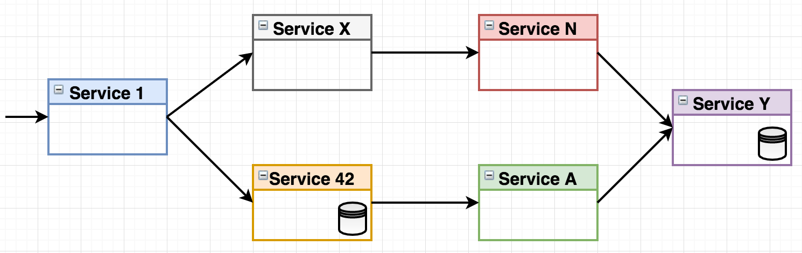
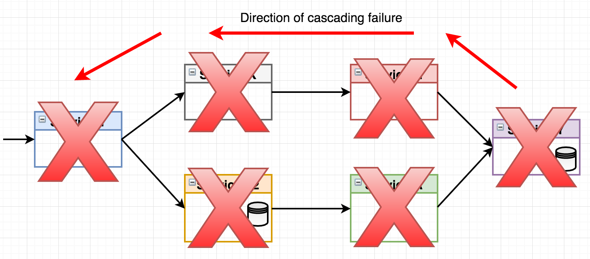
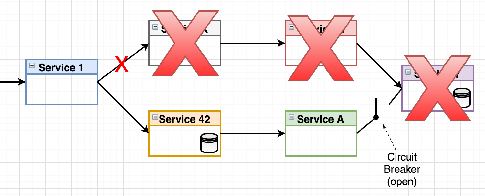
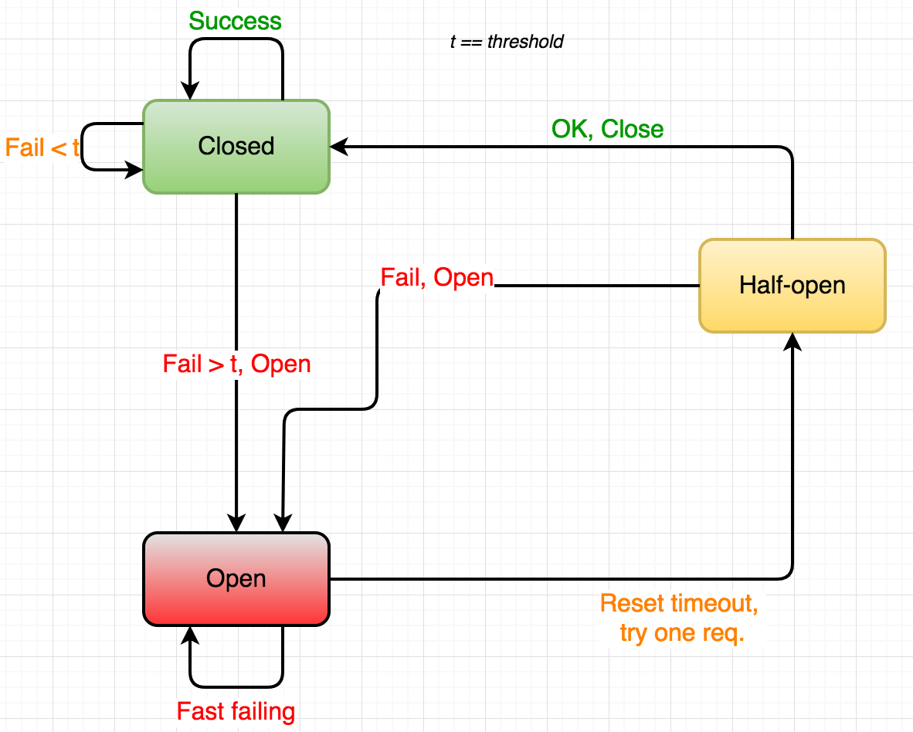
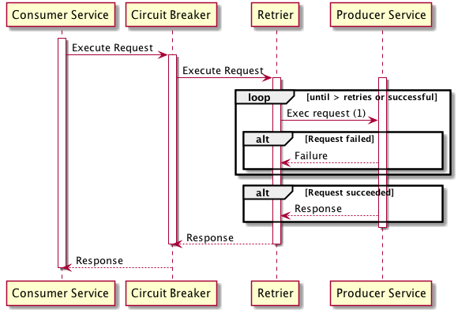
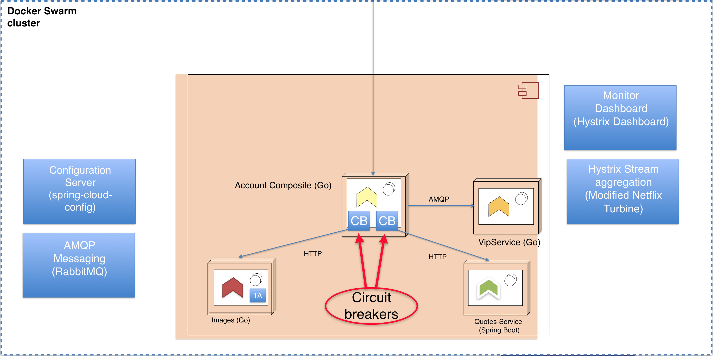

이번 블로그 포스트에서는, 서비스간 통신이 이뤄질 때 통신이 좀 더 resilient하도록 circuit breaker 패턴을 사용해보겠습니다 

### Overview

아래 그림과 같은 아키텍처를 한번 생각해보죠

서비스 Y에서 장애가 발생하면 무슨 일이 일어날까요? 예를 들어 서비스 Y가 request들을 계속해서 받지만 response를 주지 않고 계속 기다린다고 합시다. 해당 서비스의 클라이언트 (service N, service A)들은 결국 타임아웃으로 처리 할 것입니다. 그런데 당신의 서비스가 일 초에 100~1000개의 요청을 처리하는 시스템이라면 thread pool이 계속 꽉차게 될것이고, 메모리 사용량이 엄청나게 올라갈 것입니다 + end 클라이언트들은 계속 기다릴 것이고요. 마이크로서비스에서는 이 문제들이 계속 cascade될 것입니다. 

제대로된 healtcheck을 구현함으로서 container orchestor가 서비스를 재시작 할 수 있겠지만, 몇분이나 걸릴주도 모릅니다. 

### Circuit Breaker

위 그림에서 serviceA와 serviceY에 circuit breaker가 존재합니다. circuit breaker는 토마슨 에디슨이 발명한 뭐시기 인데요. Circuit Breaker는 문제가 발생하면, circuit breaker를 열고, 문제가 다른쪽으로 전파되지 않게 합니다. 

- Closed : circuit breaker는 평소에는 closed된 상태로 request들이 들어오게 합니다
- Open : 문제가 발생하면, circuit은 open이되고 요청을 기다리지 하지 않게 하고 바로 fast fail 합니다
- Half-Open : Circuit은 periodically하게 request를 들어오게 하는데요, 그 요청이 성공한다면 circuit을 다시 close합니다

Hystrix의 close circuit은 

- Hystrix는 문제가 있을 시 consumer에게 돌려줄 fallback function을 정의할 수 있게 해줍니다.
- 문제 전파를 막습니다. Request를 기다리게 하지 않고 바로 돌려주기 때문에, thread pool이 꽉차는것을 방지하니다

### Retrier & Resilience

Circuit Breaker는 Producer가 죽으면 에러를 즉시 반환하여 cascade 문제를 막는데요. 근데 마이크로서비스에서는 Producer 서비스가 하나일 가능성의 적습니다. 아니 왜 하나의 인스턴스가 실패했는데 다른 인스턴스도 연락해 봐야하는거 아니오? 라는 질문을 던질수 있죠. 여기서 retrier라는 개념이 나옵니다 

Docker Swarm에서 3개의 producer 서비스 인스턴스가 있다고 합시다. 그러면 swarm load-balancer가 round-robin으로 서비스의 인스턴스들을 골라주겠죠. 그래서 바로 실패하는게 아니라, 인스턴스 수 만큼 retry를 하는 메커니즘을 구현하는 것이 어떨 까요? 

- retrier는 circuit breaker안에서 실행됩니다
- circuit breaker는 request fail처리를 retry가 다 끝나면 합니다.

### 아키텍처

accountservice에 quote-service와 새로운 서비스인 imageservice로 통신하는 것을 circuit breaker로 감싸보죠. 

